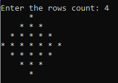

# Diamond Square

## Description
A Program to print the Diamond Sqaure Pattern. The rows count is given as a input which denotes the longest row in the pattern.

## Code
```c
#include<stdio.h>
void main(){
    int temp;
    printf("\nEnter the no of rows: ");
    scanf("%d",&temp);
    int n=2*temp-1;

    // The Top Pyramid
    for(int i=0;i<n/2;i++){
        for(int j=n/2;j>i;j--){
            printf("  ");
        }
        for(int j=0;j<2*i+1;j++){
            printf("* ");
        }
        printf("\n");
    }

    //The bottom Pyramid
    for(int i=n/2;i>=0;i--){
        for(int j=n/2;j>i;j--){
            printf("  ");
        }
        for(int j=0;j<2*i+1;j++){
            printf("* ");
        }
        printf("\n");
    }
}
```

## Output



## Contributed By

| Name | GitHub Username | Institute |
| --- | --- | --- |
| Arnab Bhakta | arnab031 | Future Institute of Engineering and Management, Kolkata |