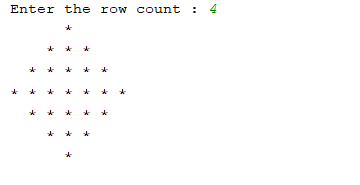

# Print a Diamond pattern enclosed in a square

## Code
```Java
import java.util.*;
public class Diamond_Square 
{
    public static void main(String[]args)
    {
        Scanner sc=new Scanner(System.in);
        //row count input
        System.out.print("Enter the row count : ");
        int N=sc.nextInt();
        int i,j,k;
        //printing the upper half of the diamond including the middle part
        for(i=1;i<=N;i++)
        {
            for(j=1;j<=(N-i);j++)
                System.out.print("  ");
            for(k=1;k<=(2*i-1);k++)
                System.out.print("* ");
            System.out.println();
        }
        //printing the lower part of the diamond after the middle part
        for(i=N-1;i>=1;i--)
        {
            for(j=N-i;j>=1;j--)
                System.out.print("  ");
            for(k=(2*i-1);k>=1;k--)
                System.out.print("* ");
            System.out.println();
        }
    }
}
```

## Description

`Scanner` is a java.util package class that is used to take input from console. 

First outer for loop displays half of the diamond pattern, second outer for loop displays the remaining half of the diamond pattern.


## Output



## Contributed By

| Name         | GitHub Username                                 | Institute                                              |
| -------------| ------------------------------------------------| -------------------------------------------------------|
| Bhaswati Saha| Bhaswati-Saha                                   | Future Institute of Engineering and Management,Kolkata |
